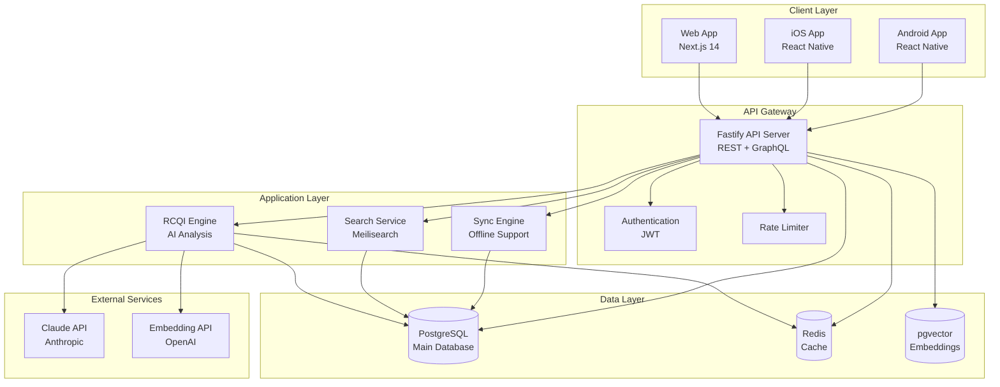
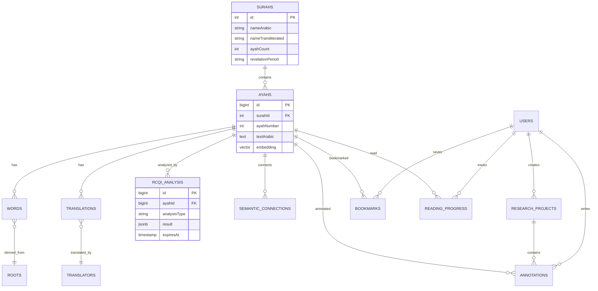
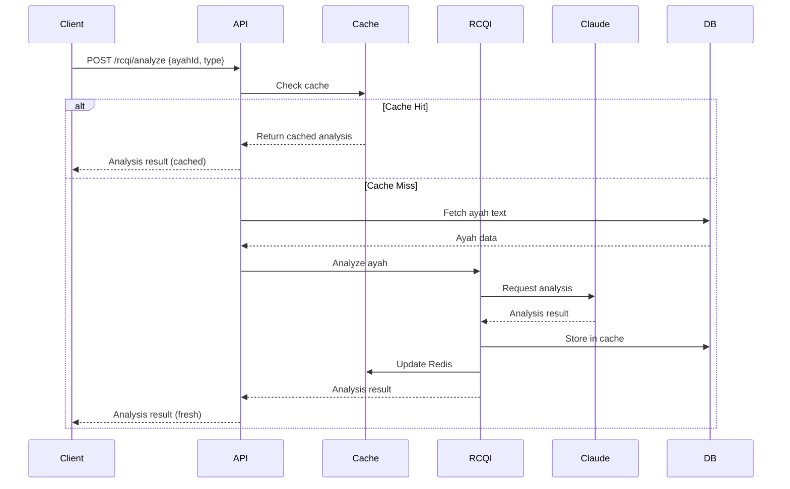
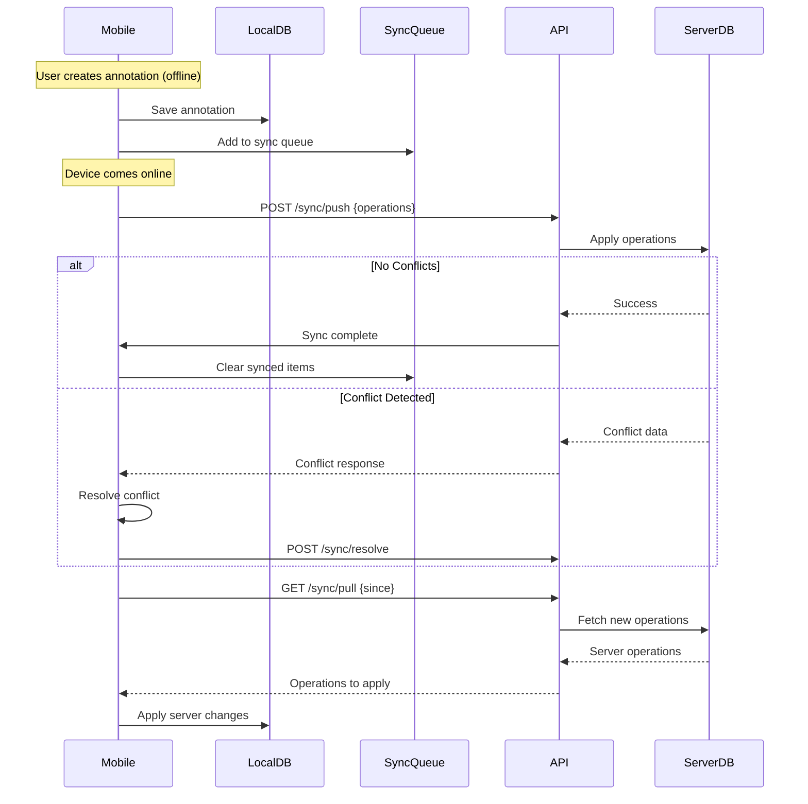
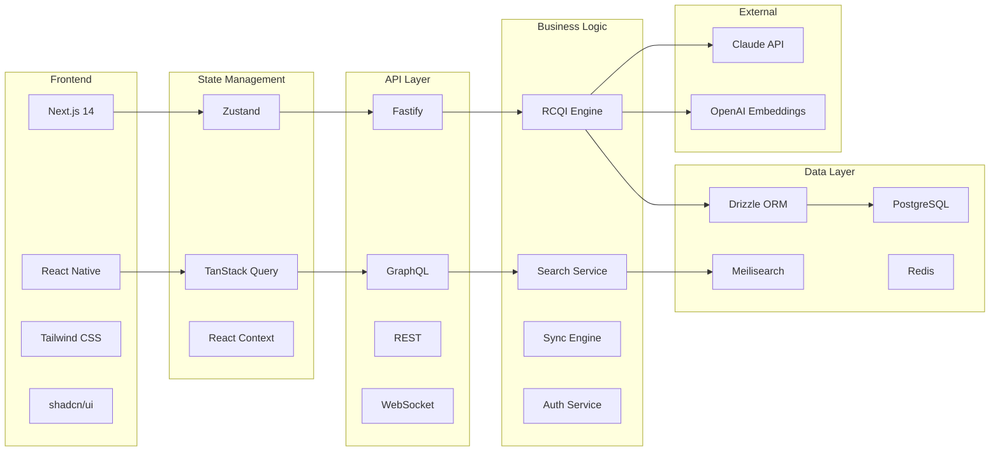
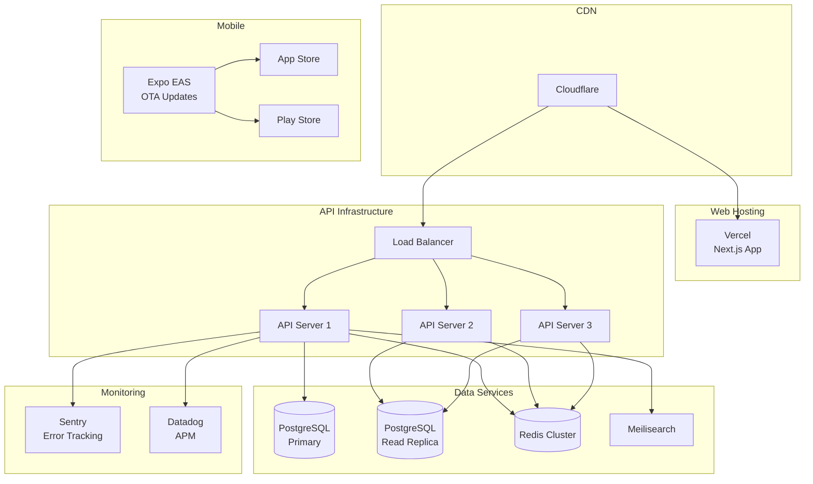
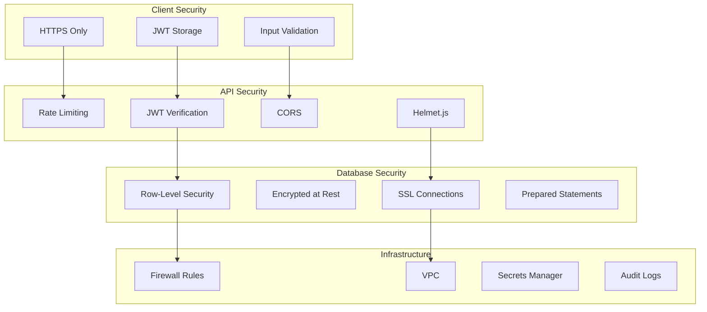
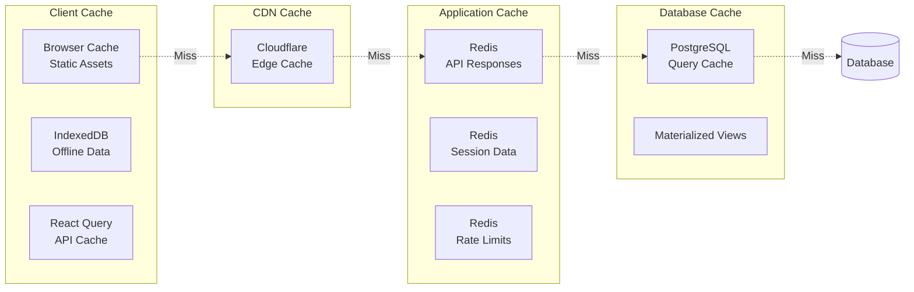

# RCQI Platform - System Architecture Diagram

## High-Level Architecture

## Database Schema Relationships

## Data Flow - RCQI Analysis

## Offline Sync Flow

## Technology Stack Layers

## Deployment Architecture

## Security Architecture

## Caching Strategy

---

## Performance Targets

| Metric | Target | Measurement |
|--------|--------|-------------|
| API Response (cached) | < 100ms | p95 |
| API Response (uncached) | < 500ms | p95 |
| Search Response | < 50ms | p95 |
| Database Query | < 50ms | p95 |
| Page Load (Web) | < 2s | LCP |
| App Launch (Mobile) | < 1s | Cold start |
| Sync Operation | < 2s | 100 items |

## Scalability Targets

| Resource | Initial | 1 Year | 5 Years |
|----------|---------|--------|---------|
| Users | 1K | 100K | 1M |
| API Requests/day | 100K | 10M | 100M |
| Database Size | 10GB | 100GB | 1TB |
| Concurrent Users | 100 | 10K | 100K |

